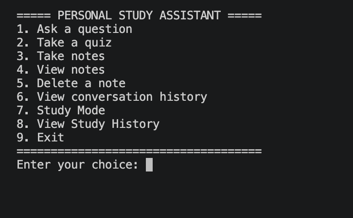

# Personal Study Assistant

## ✨Live Demo✨

[Try the personal Study Assistant](https://j-y-study-buddy-assistant.streamlit.app/)

AI powered Study Buddy built by me integrating OpenAI and Streamlit.

Built with Python, The application helps students study, take notes, practice questions, and track their study progress.

## Features

- Ask AI questions
- Take quizzes
- Choose quiz difficulty
- Randomized quiz questions
- Get explanations for answers
- Create, view, and delete notes
- View conversation history
- AI powered Study Mode
- Interactive practice questions
- Automatic scoring
- Study progress/history tracking
- Saves notes and study history between sessions

## Technologies Used

- Python
- OpenAI API
- JSON
- python-dotenv

## How It Works

The application provides a menu where users can choose different study tools.

Study Mode allows the user to enter a topic, receive an AI-generated lesson, answer practice questions, and receive feedback and a score.

The application also saves study information locally so users can view their previous study sessions.

## Demo



## Setup

### 1. Clone the repository

```bash
git clone https://github.com/BigNasty2900/personal-study-assistant.git
